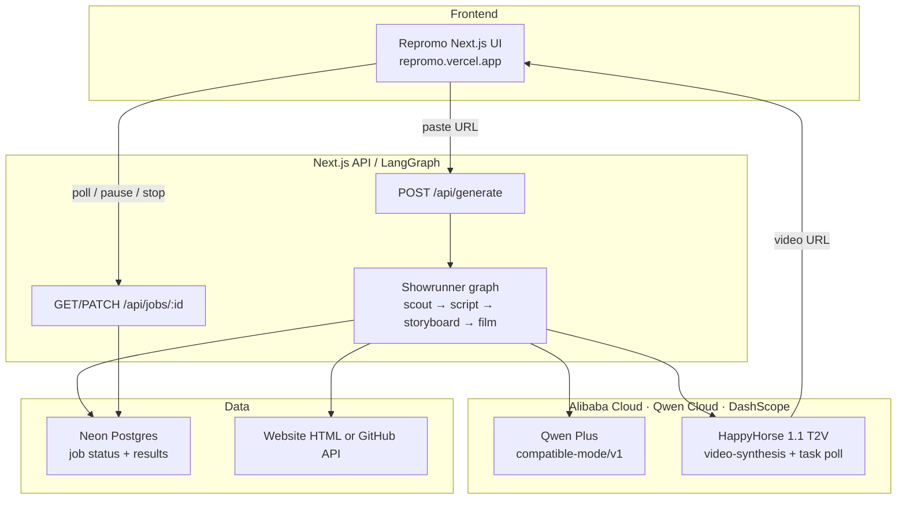

<div align="center">

# Repromo

**You vibe coded the app. We make the demo.**

Paste a **website** or **GitHub** URL. A multi-agent showrunner on [Qwen Cloud](https://home.qwencloud.com) (Alibaba Cloud DashScope) writes the pitch, plans the scenes, and films real demo clips with **HappyHorse**.

[Live app](https://repromo.vercel.app) · [Public repo](https://github.com/fozagtx/repromo) · [Architecture](#architecture-diagram) · [License: MIT](LICENSE)

</div>

---

## Hackathon submission

| Field | Value |
| --- | --- |
| **Track** | **Track 2: AI Showrunner** (Global AI Hackathon with Qwen Cloud) |
| **Code repository (public)** | https://github.com/fozagtx/repromo |
| **Live demo** | https://repromo.vercel.app |
| **Open source license** | [MIT](LICENSE) (detectable on the GitHub About panel) |
| **Alibaba Cloud proof (code)** | [`src/lib/qwen/client.ts`](src/lib/qwen/client.ts) · [`src/lib/video/happyhorse.ts`](src/lib/video/happyhorse.ts) |
| **Architecture** | See [diagram below](#architecture-diagram) and [`docs/ARCHITECTURE.md`](docs/ARCHITECTURE.md) |
| **Demo video (~3 min)** | _Add public YouTube / Vimeo / Facebook Video URL here before submit_ |

### Proof of Alibaba Cloud / Qwen Cloud usage

Backend calls **Alibaba Cloud DashScope** (Qwen Cloud) APIs live. There is **no mock mode**.

| Service | Model / API | Proof in repo |
| --- | --- | --- |
| Qwen chat (scout, script, storyboard) | `qwen-plus` via DashScope OpenAI-compatible endpoint | [`src/lib/qwen/client.ts`](https://github.com/fozagtx/repromo/blob/main/src/lib/qwen/client.ts) → `https://dashscope-intl.aliyuncs.com/compatible-mode/v1` |
| HappyHorse text-to-video | `happyhorse-1.1-t2v` async video synthesis | [`src/lib/video/happyhorse.ts`](https://github.com/fozagtx/repromo/blob/main/src/lib/video/happyhorse.ts) → `https://dashscope-intl.aliyuncs.com/api/v1/services/aigc/video-generation/video-synthesis` |

Orchestration: [`src/lib/agents/showrunner-graph.ts`](https://github.com/fozagtx/repromo/blob/main/src/lib/agents/showrunner-graph.ts) (LangGraph.js).

---

## Project description

**Repromo** is an AI showrunner for builders who shipped an app but still need a launch / demo video.

1. You paste a **public website** or **GitHub repo**.
2. Agents **read** what you built, **write** a short pitch, **plan** cinematic scenes, then **film** real clips.
3. You get a playable demo video plus the script, with pause / stop controls while it runs.

Built for people who vibe-coded a product and need something they can post the same day - not a slide deck of mockups.

### Features and functionality

- **Site or GitHub input** - works with product homepages and public repositories
- **Multi-agent LangGraph pipeline** - `parse → scout → script → storyboard → generate_shots → finalize`
- **Qwen-powered creative** - positioning, narration, and shot prompts grounded in real project context
- **HappyHorse video generation** - live DashScope async text-to-video (typically 2 shots, ~3-8s each at 720P)
- **Job progress UI** - stage chips, progress bar, pause / resume / stop
- **Durable jobs** - Neon Postgres so polling works across serverless instances
- **Real logos in the input** - favicon for the domain you paste
- **Fail-fast without mocks** - missing `DASHSCOPE_API_KEY` errors clearly; no fake videos

---

## Architecture diagram

Clear path from frontend → backend → Qwen Cloud (Alibaba DashScope) → video → database → UI:



More detail: [`docs/ARCHITECTURE.md`](docs/ARCHITECTURE.md)

### Pipeline

```text
parse_source → scout → script → storyboard → generate_shots → finalize
```

---

## Demo video

Upload a **public** ~3 minute walkthrough to YouTube, Vimeo, or Facebook Video, then put the link here and on Devpost:

**Video URL:** `https://youtu.be/YOUR_VIDEO_ID`

Suggested chapters for judges:

1. Problem + paste a site/repo  
2. Agents running (scout → script → storyboard → film)  
3. Pause / stop controls  
4. Final clips + script  
5. Point at Alibaba Cloud proof files in the repo  

---

## Quick start (reproduce locally)

```bash
git clone https://github.com/fozagtx/repromo.git
cd repromo
npm install
cp .env.example .env
```

Required env (see [`.env.example`](.env.example)):

```bash
DASHSCOPE_API_KEY=sk-...          # from https://home.qwencloud.com/api-keys
DATABASE_URL=postgresql://...     # Neon (or any Postgres) for job store
```

Optional:

```bash
QWEN_MODEL=qwen-plus
DASHSCOPE_VIDEO_MODEL=happyhorse-1.1-t2v
```

```bash
npm run dev
```

Open [http://localhost:3000](http://localhost:3000), paste e.g. `linear.app` or `github.com/vercel/next.js`, hit **Make video**.

> Video rendering is async and can take several minutes. Keep the tab open; use **Pause** / **Stop** if needed.

---

## Stack

| Layer | Tech |
| --- | --- |
| Frontend | Next.js 16 App Router, HeroUI, Tailwind, Iconify |
| Agents | LangGraph.js + LangChain |
| LLM | Qwen (`qwen-plus`) on Alibaba DashScope |
| Video | HappyHorse (`happyhorse-1.1-t2v`) on DashScope |
| Jobs DB | Neon Postgres |
| Hosting | Vercel (app) + Alibaba Cloud DashScope (AI backend) |

---

## API

```bash
# start
curl -X POST https://repromo.vercel.app/api/generate \
  -H 'Content-Type: application/json' \
  -d '{"url":"https://linear.app"}'

# poll
curl https://repromo.vercel.app/api/jobs/<jobId>

# pause | resume | stop
curl -X PATCH https://repromo.vercel.app/api/jobs/<jobId> \
  -H 'Content-Type: application/json' \
  -d '{"action":"pause"}'
```

---

## Project layout

```text
src/
  app/                 # Landing UI + API routes
  components/ui/       # Navbar, prompt, cards, footer, logo
  lib/
    agents/            # LangGraph showrunner
    qwen/              # Alibaba DashScope chat client  ← proof
    video/             # HappyHorse create + poll         ← proof
    source/            # Website + GitHub ingest
    jobs/              # Neon-backed job store
docs/ARCHITECTURE.md
LICENSE                # MIT
```

---

## License

[MIT](LICENSE) - open source. Copyright (c) 2026 Repromo.

---

<div align="center">

**Track 2: AI Showrunner** · Global AI Hackathon with Qwen Cloud · [fozagtx/repromo](https://github.com/fozagtx/repromo)

</div>
