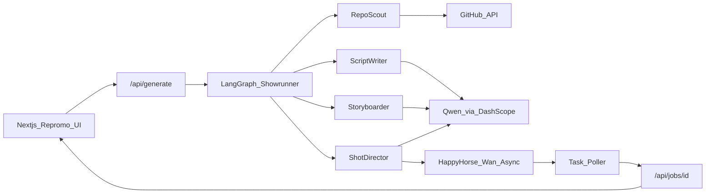

# Repromo Architecture

**Hackathon track:** Track 2 - AI Showrunner  
**Stack:** Next.js (App Router) + LangGraph.js + Qwen Cloud (DashScope) + HappyHorse / Wan video synthesis

## System overview

## Agent pipeline (LangGraph)

| Node | Model / API | Responsibility |
|------|-------------|----------------|
| `parse_repo` | GitHub REST | Ingest README, package.json, file tree (token-capped) |
| `scout` | Qwen (`qwen-plus`) | Product positioning, audience, visual motifs |
| `script` | Qwen | 15-30s promo narration (hook → problem → solution → CTA) |
| `storyboard` | Qwen | Exactly 2 shots with HappyHorse-ready `videoPrompt`s |
| `generate_shots` | HappyHorse / Wan | Async text-to-video + poll until `SUCCEEDED` |
| `finalize` | - | Primary video URL + artifacts for UI |

## Alibaba Cloud / Qwen Cloud proof

Live DashScope integration (no mocks):

- [`src/lib/qwen/client.ts`](../src/lib/qwen/client.ts) - OpenAI-compatible Chat Completions against `https://dashscope-intl.aliyuncs.com/compatible-mode/v1`
- [`src/lib/video/happyhorse.ts`](../src/lib/video/happyhorse.ts) - Async video synthesis against `https://dashscope-intl.aliyuncs.com/api/v1/services/aigc/video-generation/video-synthesis`

Required env: `DASHSCOPE_API_KEY` (see `.env.example`).

## Job flow

1. UI `POST /api/generate` with `{ repoUrl }`
2. Server creates an in-memory job and schedules the showrunner via Next.js `after()`
3. UI polls `GET /api/jobs/:id` for stage/progress
4. On `completed`, UI plays `result.primaryVideoUrl` and shows script/storyboard

## Token budget notes

- Repo context is truncated before LLM calls
- Structured outputs keep scout/script/storyboard compact
- Two shots (not three+) to stay within Track 2 quality under limited spend/latency
