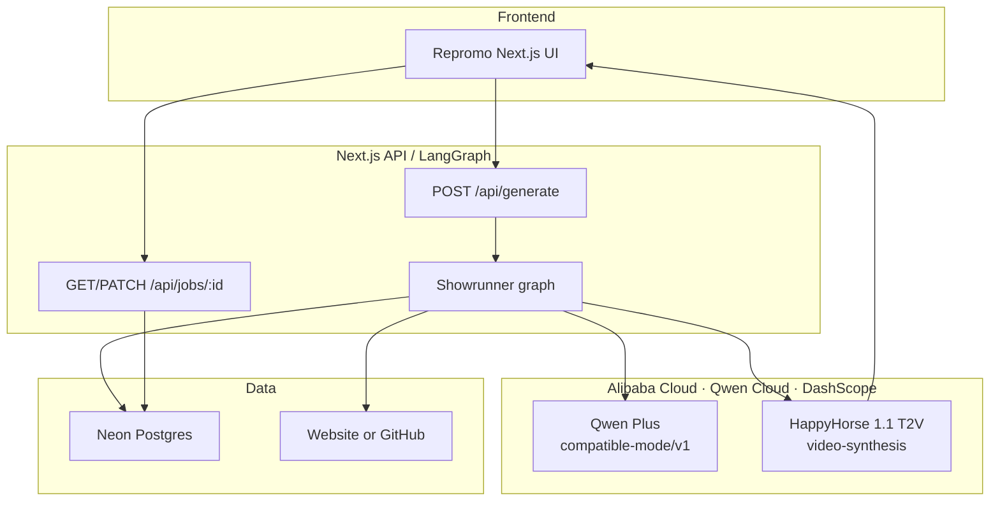

# Repromo Architecture

**Hackathon track:** Track 2 - AI Showrunner  
**Stack:** Next.js + LangGraph.js + Qwen Cloud (Alibaba DashScope) + HappyHorse + Neon

## System overview

## Agent pipeline (LangGraph)

| Node | Model / API | Responsibility |
|------|-------------|----------------|
| `parse_source` | Website fetch / GitHub REST | Ingest page or repo context (token-capped) |
| `scout` | Qwen (`qwen-plus`) via DashScope | Product positioning, audience, visual motifs |
| `script` | Qwen via DashScope | 15-30s demo narration |
| `storyboard` | Qwen via DashScope | Exactly 2 shots with HappyHorse-ready prompts |
| `generate_shots` | HappyHorse (`happyhorse-1.1-t2v`) | Async text-to-video + poll until `SUCCEEDED` |
| `finalize` | - | Primary video URL + artifacts for UI |

## Alibaba Cloud / Qwen Cloud proof

Live DashScope integration (no mocks):

- [`src/lib/qwen/client.ts`](../src/lib/qwen/client.ts) - Chat Completions against `https://dashscope-intl.aliyuncs.com/compatible-mode/v1`
- [`src/lib/video/happyhorse.ts`](../src/lib/video/happyhorse.ts) - Video synthesis against `https://dashscope-intl.aliyuncs.com/api/v1/services/aigc/video-generation/video-synthesis`

Required env: `DASHSCOPE_API_KEY` (see `.env.example`).

## Job flow

1. UI `POST /api/generate` with `{ url }`
2. Server creates a Neon-backed job and runs the showrunner via Next.js `after()`
3. UI polls `GET /api/jobs/:id` for stage/progress; can `PATCH` with `pause` / `resume` / `stop`
4. On `completed`, UI plays `result.primaryVideoUrl` and shows script / shots
